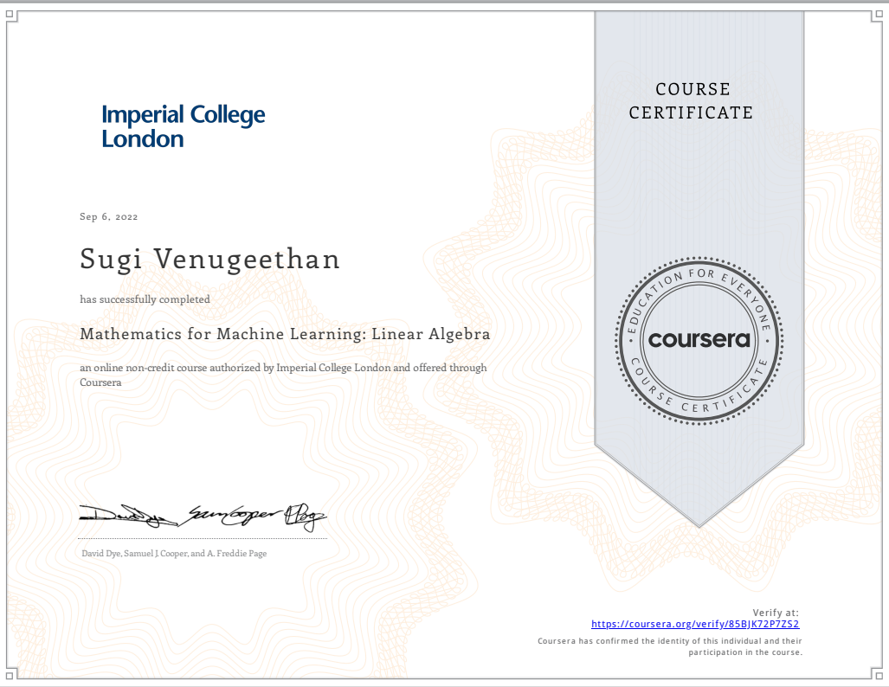
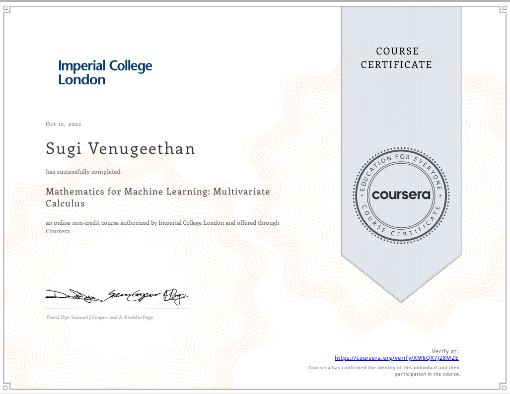
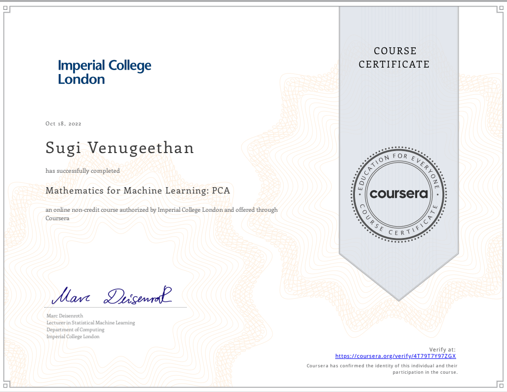
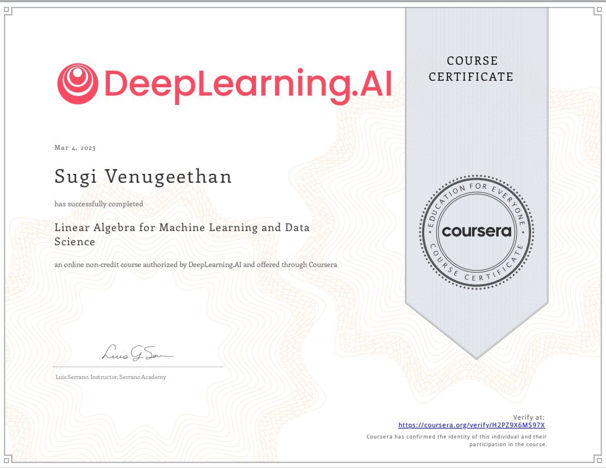
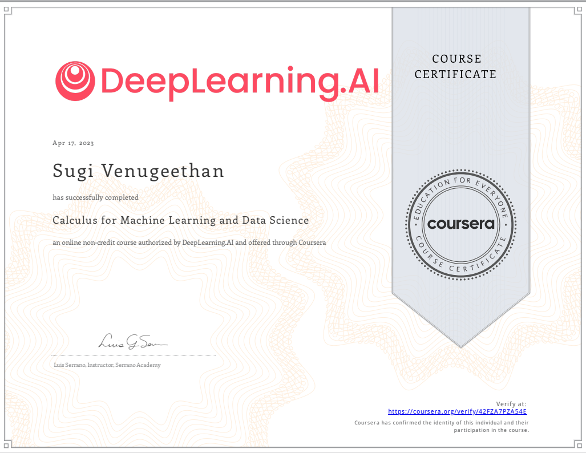
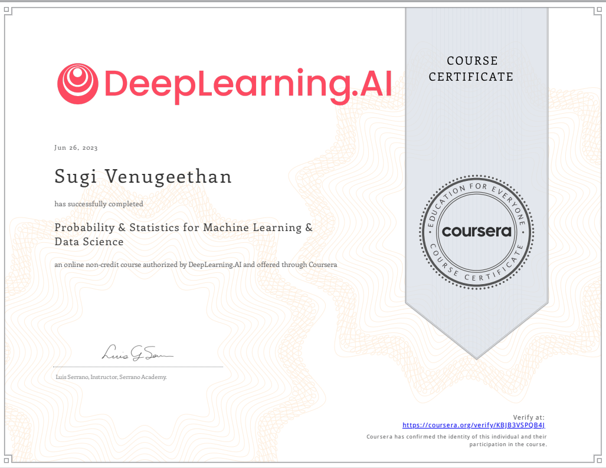

title: Home

# Key Concepts

*I have personally enjoyed learning from mathematicians [Grant Sanderson](https://www.youtube.com/c/3blue1brown),
[Lois Serrano](https://serrano.academy/) and below said book, courses more than enough for any GAN models, NLP models and classic machine learning and deep learning models.*

- Even though modern machine learning and deep learning libraries makes maching learning and deep learning easy, it is crucial to understand certain concepts to understand the core of model architectures and efficient model building. 
- It is still possible to use above said library API's and easily use existing model weights to create a machine learning pipeline. However, I strongly believe understanding the math behind helps long way. 

## 3Blue1Brown

    [3B1B](https://www.3blue1brown.com/#lessons)

## Mathematic for Machine Learning Book

    My favorite book - Mathematics For Machine Learning Book

[Link to book => ](https://mml-book.github.io/)

## Mathematics for Machine Learning and Deep Learning Specialization

    My favorite teacher - Lois Serrano 

[Course => ](https://www.coursera.org/specializations/mathematics-for-machine-learning-and-data-science)

## Mathematics for Maching Learning Specialization

| Imperial College London

[Course => ](https://www.coursera.org/specializations/mathematics-machine-learning)

## Certficates

